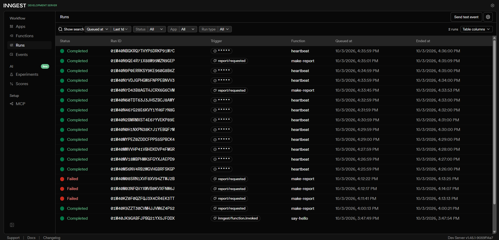

# Your first background job

A small Express API where the slow work (an 8 second report) runs in a background job. The endpoint answers instantly with 202, a status endpoint reports the result, and a cron job runs on its own every minute. Background jobs and cron are handled by Inngest.

## How to run

Create a `.env` file in the project root:

```text
INNGEST_DEV=1
```

Install dependencies once:

```bash
npm install
```

Terminal 1, the API:

```bash
node --env-file=.env index.js
```

Terminal 2, the Inngest Dev Server:

```bash
npx --ignore-scripts=false inngest-cli@latest dev -u http://localhost:3000/api/inngest
```

Open the dashboard at <http://localhost:8288>

## Endpoints

| Method | Path | What it does |
| --- | --- | --- |
| GET | /health | Returns `{ "status": "ok" }` |
| POST | /reports | Validates `topic`, saves a pending report, sends the `report/requested` event, answers 202 with an id. Missing topic returns 400 |
| GET | /reports/:id | Returns the report: `pending` first, `done` with the result later. Unknown id returns 404 |
| ALL | /api/inngest | Serves the Inngest functions |

## Inngest functions

| Function | Trigger | What it does |
| --- | --- | --- |
| say-hello | event `test/hello` | Sleeps 5 seconds and returns a greeting |
| make-report | event `report/requested` | Sleeps 8 seconds (sleep step), then builds the report (run step). Retries: 2 |
| heartbeat | cron `* * * * *` | Logs how many reports are pending, done and failed |

## Proof: 202 then poll

```text
HTTP/1.1 202 Accepted
{"id":"b0c8935e-c11c-4580-bf35-28cfeb7e28e3","status":"pending"}
```

Poll right away:

```text
{"id":"b0c8935e-c11c-4580-bf35-28cfeb7e28e3","topic":"cats","status":"pending"}
```

Poll about 10 seconds later:

```text
{"id":"b0c8935e-c11c-4580-bf35-28cfeb7e28e3","topic":"cats","status":"done","result":"Report about cats is ready"}
```

## Stage 3: retries

A missing topic is bad input, so the server rejects it right away with 400 because retrying can never fix it, while a failed job is a bad moment, like a network hiccup, so it deserves a retry.

## Stage 4: cron

Every day at 08:00 is `0 8 * * *`, and every Sunday at 22:00 is `0 22 * * 0`.

## Dashboard

The dashboard shows a completed `make-report` run, failed `make-report` runs after their retries, and the `heartbeat` cron runs one minute apart.


